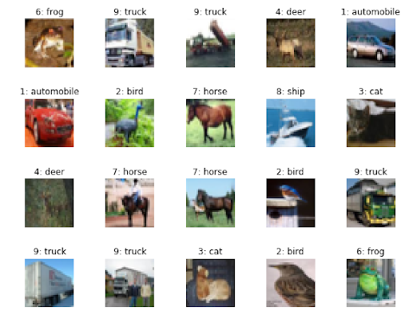

# CIFAR-10

**CIFAR-10** est un dataset emblématique de la communauté *machine learning*, largement utilisé pour tester et comparer les performances des modèles d'apprentissage automatique, en particulier les réseaux de neurones convolutifs (**CNN**).

## Description

Le jeu de données contient **60 000 images couleur** de **32x32 pixels**, réparties en **10 classes distinctes**. Chaque classe comprend **6 000 images**.

Les **classes** sont les suivantes :

- Avion  
- Automobile  
- Oiseau  
- Chat  
- Cerf  
- Chien  
- Grenouille  
- Cheval  
- Bateau  
- Camion

## Répartition des données

- **50 000 images** pour l'entraînement  
- **10 000 images** pour les tests

## Pourquoi CIFAR-10 est populaire ?

- **Petit** : léger et rapide à charger, idéal pour prototyper rapidement.  
- **Accessible** : facile à manipuler, adapté aux débutants comme aux chercheurs.  
- **Challenge intéressant** : malgré sa simplicité, il reste suffisamment complexe pour mettre à l'épreuve des architectures modernes.

## Lien officiel

Dataset disponible ici :  
[https://www.cs.toronto.edu/~kriz/cifar.html](https://www.cs.toronto.edu/~kriz/cifar.html)
