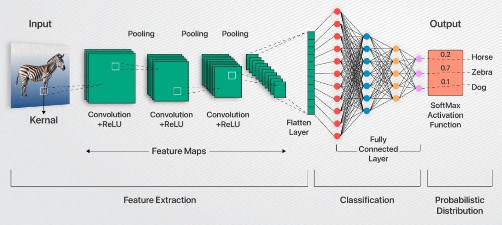

# Convolutional Neural Network - CNN

Un CNN est un type particulier de réseau de neurones artificiels très utilisé pour traiter des données structurées en grille, comme les images.

## Objectif

L'objectif principal est d'extraire automatiquement des caractéristiques importantes d'une image, telles que les bords, les formes, les textures, etc.

## Principe de fonctionnement

### Convolution

C'est l'opération fondamentale du CNN. Le réseau applique des petits filtres (ou noyaux) qui glissent sur l'image afin de détecter des motifs locaux.

### Couches de convolution

Plusieurs couches convolutionnelles sont empilées pour extraire des caractéristiques de complexité croissante. Les premières couches détectent des bords ou des textures simples, tandis que les couches plus profondes capturent des formes complexes ou même des objets entiers.

### Pooling

Pour réduire la taille des représentations intermédiaires et rendre le modèle plus robuste aux petites translations, on applique souvent des opérations de pooling (comme le max pooling), qui condensent une zone en une seule valeur représentative.

### Couches pleinement connectées

En fin de réseau, des couches pleinement connectées (semblables à un MLP) sont généralement utilisées pour effectuer la classification finale à partir des caractéristiques extraites.

---

On peut schématiquement résumer un CNN par la formule suivante :  
**CNN = [Couches convolutionnelles + Pooling] + Couches pleinement connectées (ex : MLP)**

*Note : il s'agit d'une simplification qui ne couvre pas toutes les variantes et optimisations possibles.*

## Ressources

- [Vidéo explicative sur les CNN](https://www.youtube.com/watch?v=zG_5OtgxfAg)  
- Livre **Deep Learning** de Ian Goodfellow, Yoshua Bengio et Aaron Courville  
- Livre **Quand la machine apprend** de Yann LeCun  