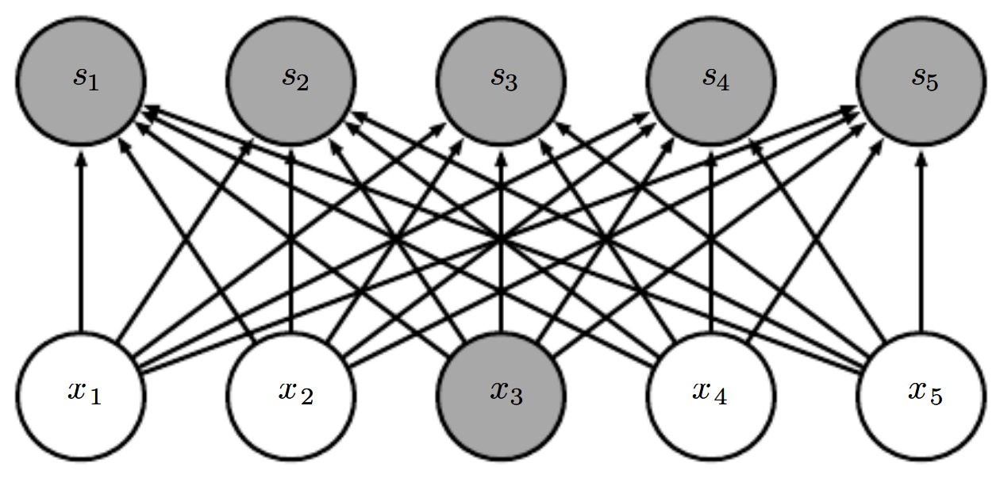

# Dense (Fully Connected Layer)

Une couche **Dense** (ou "Fully Connected") est une couche de neurones dans laquelle **chaque neurone est connecté à toutes les sorties de la couche précédente**.



---

## 🎯 Objectif
- Combiner toutes les caractéristiques extraites en amont (par convolution, pooling, etc.) pour produire une **sortie finale**, souvent une classification.
- Appliquer une transformation linéaire suivie d'une activation non-linéaire.

---

## ⚙️ Fonctionnement

Pour un vecteur d'entrée `x` :
```
y = activation(Wx + b)
```

- `W` : matrice de poids
- `b` : vecteur de biais
- `activation` : fonction non-linéaire (ReLU, Tanh, etc.)
- `y` : sortie du neurone

---

## 🧠 Dense vs MLP

> ⚠️ On confond souvent **Dense** et **MLP**, mais ce n’est pas la même chose.

| Terme     | Description |
|-----------|-------------|
| **Dense** | Une **seule** couche pleinement connectée. |
| **MLP**   | Un **empilement de plusieurs couches Dense** avec des fonctions d'activation. C'est un vrai **réseau de neurones profond**. |

Exemple d’un MLP :
```
Input → Dense → ReLU → Dense → ReLU → Dense → Softmax
```

---

## 📦 Exemple concret

Si la couche précédente a produit un vecteur de taille `128`, et qu’on veut une sortie de taille `10` (par exemple, pour classifier 10 classes), alors :

- `W` : matrice 10 × 128
- `b` : vecteur de taille 10
- La sortie `y` : vecteur de scores (souvent passé à une Softmax pour obtenir des probabilités)

---

## 📚 Ressources

- [CS231n – Fully Connected Layers](http://cs231n.github.io/neural-networks-1/#fc)
- *Deep Learning* – Ian Goodfellow, Yoshua Bengio, Aaron Courville
- *Quand la machine apprend* – Yann LeCun
