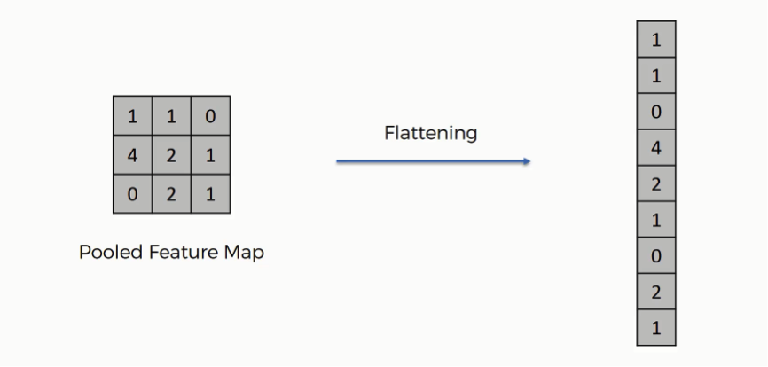

# Flatten  
**Couche utilisée dans les réseaux de neurones pour transformer une entrée multi-dimensionnelle en un vecteur 1D.**

---

## 📌 Objectif  
- Convertir une représentation spatiale (ex : volume 3D hauteur×largeur×canaux) en un vecteur plat.  
- Permettre la connexion avec des couches pleinement connectées (MLP) en fin de réseau.

- La couche flatten **aplatit** les données pour qu’elles puissent être traitées par des couches denses classiques.  
- C’est un passage obligé entre la partie convolutionnelle et la partie “classique” du réseau.

---

## ⚙️ Comment ça fonctionne ?  
La couche **flatten** prend un tenseur d’entrée, par exemple une sortie de taille `(batch_size, hauteur, largeur, canaux)`, et le transforme en un vecteur de taille `(batch_size, hauteur × largeur × canaux)`.

---

## 📉 Exemple  
Si la sortie d’une couche convolutionnelle est de taille `(1, 4, 4, 8)` (batch de 1 image, 4×4 pixels, 8 canaux), alors après flatten, la forme sera `(1, 128)` car `4×4×8 = 128`.

---

## 🔁 Alternatives  
- Certaines architectures utilisent des couches **Global Average Pooling** pour réduire spatialement les données avant la couche dense, évitant ainsi le flatten classique.

---

## 📚 Ressources  
- [Stanford CS231n – CNN architectures](http://cs231n.stanford.edu/slides/2017/cs231n_2017_lecture5.pdf)  
- *Deep Learning* – Ian Goodfellow et al.  
- *Quand la machine apprend* – Yann LeCun  
