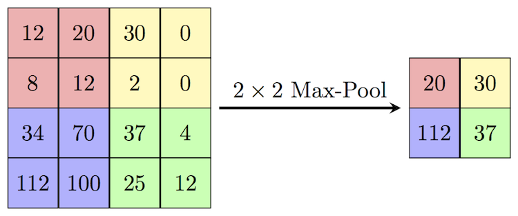

# MaxPool2D  
**Opération de sous-échantillonnage utilisée dans les CNN pour réduire les dimensions spatiales (hauteur/largeur) des données.**



---

## 📌 Objectif  
- Réduire le nombre de paramètres  
- Rendre le modèle plus robuste aux petites translations  
- Conserver l'information importante (maximale) d'une zone locale  

---

## ⚙️ Comment ça fonctionne ?  
On découpe l'image en petites fenêtres (ex: 2×2) et on garde **uniquement la valeur maximale** dans chaque fenêtre.

---

## 🧮 Hyperparamètres  

- **kernel_size** : taille du filtre (ex : 3×3 ou 5×5)  
  Définit la zone locale analysée par le filtre

- **stride** : pas de déplacement du filtre  
  Un stride de 1 → le filtre se déplace pixel par pixel  
  Un stride de 2 → le filtre saute 1 pixel à chaque déplacement

- **padding** : ajout de zéros autour de l’image pour contrôler la taille de sortie  
  Permet d’éviter que les bords de l’image soient "mangés" par la convolution  

---

## 📉 Exemple  
Image d'entrée : 4×4  
`kernel_size = 2`, `stride = 2`

```
Entrée
┌────┬────┬────┬────┐
│ 1  │ 3  │ 2  │ 4  │
├────┼────┼────┼────┤
│ 5  │ 6  │ 1  │ 2  │
├────┼────┼────┼────┤
│ 3  │ 2  │ 0  │ 1  │
├────┼────┼────┼────┤
│ 7  │ 4  │ 5  │ 6  │
└────┴────┴────┴────┘

MaxPool2D (2×2, stride 2)
→

Sortie
┌────┬────┐
│ 6  │ 4  │
├────┼────┤
│ 7  │ 6  │
└────┴────┘
```

---

## 🧠 Intuition  
- Le **max pooling** agit comme un extracteur de caractéristiques fortes (ex : bords marqués, intensités élevées).  
- Il simplifie la représentation tout en gardant les zones les plus saillantes de l'image.  

---

## 🔁 Alternatives  
- **Average Pooling** : prend la moyenne au lieu du max.  
- **Global Pooling** : réduit chaque canal à une seule valeur (utilisé en fin de réseau parfois).

---

## 📚 Ressources  
- [Stanford CS231n – CNN architectures](http://cs231n.stanford.edu/slides/2017/cs231n_2017_lecture5.pdf)  
- *Deep Learning* – Ian Goodfellow et al.  
- *Quand la machine apprend* – Yann LeCun  
- [Max pooling explained (YouTube)](https://www.youtube.com/watch?v=zG_5OtgxfAg)  
